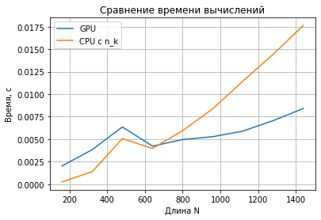
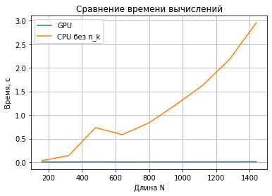
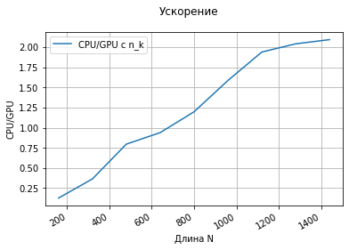
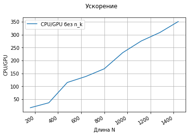

# Lab №3 - Mass search
## Borisov Dmitriy 6133-010402D

## Задание

__Задача__: Реализовать массовый поиск подстрок на GPU и на CPU ([Task file](mass_search.pdf))

## Техническое оборудование
__Язык программирования__: Python v3.7.12

__IDE__: Google Colaboratory

__GPU__: Tesla K80

__CPU__: Intel(R) Xeon(R) CPU @ 2.30GHz

## Описание
__Предобработка символов алфавита__: Создаётся словарь с ключами - элементами алфавита и значениями - (n, k),
где n - индекс подстроки N[n], k - индекс символа в подстроке N[n]. Для каждого N[n, k] в словарь для соответствующего символа заносится кортеж (n, k).

__GPU реализация__: Каждый поток с абс. индексами x и y рассматривает каждый символ N[y]-подстроки для H[x] символа входного буфера. 
Если символ подстроки с индексом k совпал с символом H[x], то R[y, x - k] элемент рабочей матрицы декрементируется.

__CPU реализация без использования (n,k)__: Пробегаемся по каждому элементу (i, j) рабочей матрицы R и, если k-ый символ подстроки N[i] совпал с H[j], 
декрементируем значение R[i, j - k].

__CPU реализация с использованием (n,k)__: Пробегаемся по каждому символу входного буффера H, получаем вхождения (n, k) этого символа в подстроки.
Для каждого (n, k) декрементируем значение R[n, i - k].

Производился подсчёт среднего времени вычислений трёх реализаций, результаты которых представлены на графиках и в таблице.

## Графики

## Таблица
<table border="0" cellpadding="0" cellspacing="0" id="sheet0" class="sheet0 gridlines">
    <col class="col0">
    <col class="col1">
    <col class="col2">
    <col class="col3">
    <col class="col4">
    <col class="col5">
    <col class="col6">
    <col class="col7">
    <col class="col8">
    <tbody>
      <tr class="row0">
        <td class="column0">&nbsp;</td>
        <td class="column1 style1 s">Длина N</td>
        <td class="column2 style1 s">Длина H</td>
        <td class="column3 style1 s">GPU</td>
        <td class="column4 style1 s">CPU без n_k</td>
        <td class="column5 style1 s">CPU/GPU без n_k</td>
        <td class="column6 style1 s">CPU с n_k</td>
        <td class="column7 style1 s">CPU/GPU с n_k</td>
        <td class="column8 style1 s">Одиннаковые значения</td>
      </tr>
      <tr class="row1">
        <td class="column0 style1 n">160</td>
        <td class="column1 style0 n">160</td>
        <td class="column2 style0 n">160</td>
        <td class="column3 style0 n">0.0020357131958008</td>
        <td class="column4 style0 n">0.034451627731323</td>
        <td class="column5 style0 n">16.923615665698</td>
        <td class="column6 style0 n">0.00025904178619385</td>
        <td class="column7 style0 n">0.12724866485524</td>
        <td class="column8 style0 b">1</td>
      </tr>
      <tr class="row2">
        <td class="column0 style1 n">320</td>
        <td class="column1 style0 n">320</td>
        <td class="column2 style0 n">320</td>
        <td class="column3 style0 n">0.0038405656814575</td>
        <td class="column4 style0 n">0.13878121376038</td>
        <td class="column5 style0 n">36.135617841512</td>
        <td class="column6 style0 n">0.0014011859893799</td>
        <td class="column7 style0 n">0.36483843933327</td>
        <td class="column8 style0 b">1</td>
      </tr>
      <tr class="row3">
        <td class="column0 style1 n">480</td>
        <td class="column1 style0 n">480</td>
        <td class="column2 style0 n">480</td>
        <td class="column3 style0 n">0.0063627958297729</td>
        <td class="column4 style0 n">0.73077857494354</td>
        <td class="column5 style0 n">114.85180327869</td>
        <td class="column6 style0 n">0.0050678491592407</td>
        <td class="column7 style0 n">0.79648149882904</td>
        <td class="column8 style0 b">1</td>
      </tr>
      <tr class="row4">
        <td class="column0 style1 n">640</td>
        <td class="column1 style0 n">640</td>
        <td class="column2 style0 n">640</td>
        <td class="column3 style0 n">0.0042332172393799</td>
        <td class="column4 style0 n">0.58439593315125</td>
        <td class="column5 style0 n">138.0500692747</td>
        <td class="column6 style0 n">0.003978419303894</td>
        <td class="column7 style0 n">0.93980986066211</td>
        <td class="column8 style0 b">1</td>
      </tr>
      <tr class="row5">
        <td class="column0 style1 n">800</td>
        <td class="column1 style0 n">800</td>
        <td class="column2 style0 n">800</td>
        <td class="column3 style0 n">0.0049663066864014</td>
        <td class="column4 style0 n">0.83411946296692</td>
        <td class="column5 style0 n">167.95568933568</td>
        <td class="column6 style0 n">0.0059510707855225</td>
        <td class="column7 style0 n">1.198289022669</td>
        <td class="column8 style0 b">1</td>
      </tr>
      <tr class="row6">
        <td class="column0 style1 n">960</td>
        <td class="column1 style0 n">960</td>
        <td class="column2 style0 n">960</td>
        <td class="column3 style0 n">0.0052826881408691</td>
        <td class="column4 style0 n">1.2175196409225</td>
        <td class="column5 style0 n">230.47350296969</td>
        <td class="column6 style0 n">0.0083852767944336</td>
        <td class="column7 style0 n">1.5873124763057</td>
        <td class="column8 style0 b">1</td>
      </tr>
      <tr class="row7">
        <td class="column0 style1 n">1120</td>
        <td class="column1 style0 n">1120</td>
        <td class="column2 style0 n">1120</td>
        <td class="column3 style0 n">0.0059086799621582</td>
        <td class="column4 style0 n">1.6286437988281</td>
        <td class="column5 style0 n">275.63581193408</td>
        <td class="column6 style0 n">0.011464047431946</td>
        <td class="column7 style0 n">1.940204496667</td>
        <td class="column8 style0 b">1</td>
      </tr>
      <tr class="row8">
        <td class="column0 style1 n">1280</td>
        <td class="column1 style0 n">1280</td>
        <td class="column2 style0 n">1280</td>
        <td class="column3 style0 n">0.0070637464523315</td>
        <td class="column4 style0 n">2.1776037931442</td>
        <td class="column5 style0 n">308.27887266897</td>
        <td class="column6 style0 n">0.014428734779358</td>
        <td class="column7 style0 n">2.0426461901949</td>
        <td class="column8 style0 b">1</td>
      </tr>
      <tr class="row9">
        <td class="column0 style1 n">1440</td>
        <td class="column1 style0 n">1440</td>
        <td class="column2 style0 n">1440</td>
        <td class="column3 style0 n">0.0084166288375854</td>
        <td class="column4 style0 n">2.9544041395187</td>
        <td class="column5 style0 n">351.01989128064</td>
        <td class="column6 style0 n">0.017628836631775</td>
        <td class="column7 style0 n">2.0945246573131</td>
        <td class="column8 style0 b">1</td>
      </tr>
    </tbody>
</table>

## Вывод
Выполнение массового поиска подстрок стандартным средствами на Python заметно уступает распараллеленной версии с помощью numba.
Использование предобработки (n,k) заметно ускорило CPU-реализацию, 
но даже не смотря на передачу данных, в GPU-реализации оказалась быстрее благодаря большому количеству потоков.
