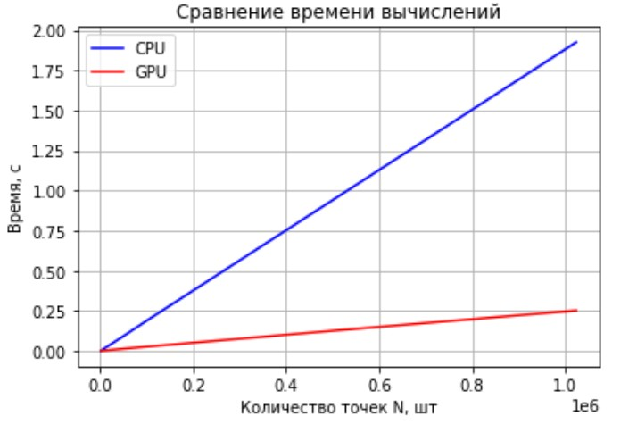
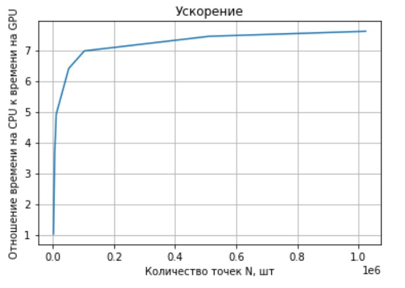

# Lab №2 - Pi (Monte Carlo)
## Borisov Dmitriy 6133-010402D

## Задание

__Задача__: Реализовать две функции рассчёта числа Пи на CPU и на GPU **(библиотека numba)** ([Task file](pi_monte_carlo.pdf))

## Техническое оборудование
__Язык программирования__: Python v3.7.12

__IDE__: Google Colaboratory

__GPU__: Tesla K80

__CPU__: Intel(R) Xeon(R) CPU @ 2.30GHz

## Описание
Для параллелного вычисления числа Пи используется библиотека numba с генерацией случайного числа от 0 до 1 с помощью [xoroshiro128p](https://numba.pydata.org/numba-doc/0.41.0/cuda/random.html).

Функция вычисления Пи на GPU представлена функцией *gpu_pi_calculating*, в которой каждая нить генерирует координаты точки (x, y) и при соблюдении условия 
**(x^2 +y^2 < 1)** увеличивает параметр суммы на коэффициент **4/N**. Количество нитей соответствует числу точек.

Функция вычисления Пи на CPU аналогична функции на GPU, но в последовательном варианте.

В представленной ниже таблице представлены средние значений времени вычислений, отклонения подсчитанного числа Пи от истинного и значение числа Пи на последней итерации повторения (11 повторений).

## Графики

## Таблица
<table border="0" cellpadding="0" cellspacing="0" id="sheet0" class="sheet0 gridlines">
    <col class="col0">
    <col class="col1">
    <col class="col2">
    <col class="col3">
    <col class="col4">
    <col class="col5">
    <col class="col6">
    <col class="col7">
    <tbody>
      <tr class="row0">
        <td class="column0">&nbsp;</td>
        <td class="column1 style1 s">Размерности</td>
        <td class="column2 style1 s">CPU:Среднее время</td>
        <td class="column3 style1 s">GPU:Среднее время</td>
        <td class="column4 style1 s">CPU:Среднее отклонение</td>
        <td class="column5 style1 s">GPU:Среднее отклонение</td>
        <td class="column6 style1 s">CPU:Последнее значение pi</td>
        <td class="column7 style1 s">GPU:Последнее значение pi</td>
      </tr>
      <tr class="row1">
        <td class="column0 style1 n">0</td>
        <td class="column1 style0 n">1024</td>
        <td class="column2 style0 n">0.0019623756408691</td>
        <td class="column3 style0 n">0.001916766166687</td>
        <td class="column4 style0 n">0.048383423053618</td>
        <td class="column5 style0 n">0.028311403589793</td>
        <td class="column6 style0 n">3.09375</td>
        <td class="column7 style0 n">3.11328125</td>
      </tr>
      <tr class="row2">
        <td class="column0 style1 n">1</td>
        <td class="column1 style0 n">5120</td>
        <td class="column2 style0 n">0.0097840547561646</td>
        <td class="column3 style0 n">0.0026896715164185</td>
        <td class="column4 style0 n">0.026366377599062</td>
        <td class="column5 style0 n">0.027412088709422</td>
        <td class="column6 style0 n">3.1476562500002</td>
        <td class="column7 style0 n">3.1141805648804</td>
      </tr>
      <tr class="row3">
        <td class="column0 style1 n">2</td>
        <td class="column1 style0 n">10240</td>
        <td class="column2 style0 n">0.019587540626526</td>
        <td class="column3 style0 n">0.0039841890335083</td>
        <td class="column4 style0 n">0.0079020883100612</td>
        <td class="column5 style0 n">0.035917194681712</td>
        <td class="column6 style0 n">3.1421875000004</td>
        <td class="column7 style0 n">3.1056754589081</td>
      </tr>
      <tr class="row4">
        <td class="column0 style1 n">3</td>
        <td class="column1 style0 n">51200</td>
        <td class="column2 style0 n">0.096296787261963</td>
        <td class="column3 style0 n">0.015043020248413</td>
        <td class="column4 style0 n">0.005872458111399</td>
        <td class="column5 style0 n">0.0071376879983625</td>
        <td class="column6 style0 n">3.1420312499983</td>
        <td class="column7 style0 n">3.1344549655914</td>
      </tr>
      <tr class="row5">
        <td class="column0 style1 n">4</td>
        <td class="column1 style0 n">102400</td>
        <td class="column2 style0 n">0.19485850334167</td>
        <td class="column3 style0 n">0.027939558029175</td>
        <td class="column4 style0 n">0.0034312076279893</td>
        <td class="column5 style0 n">0.0044743140512189</td>
        <td class="column6 style0 n">3.1503515624977</td>
        <td class="column7 style0 n">3.1371183395386</td>
      </tr>
      <tr class="row6">
        <td class="column0 style1 n">5</td>
        <td class="column1 style0 n">512000</td>
        <td class="column2 style0 n">0.96396572589874</td>
        <td class="column3 style0 n">0.12940900325775</td>
        <td class="column4 style0 n">0.0022491901008634</td>
        <td class="column5 style0 n">0.013733951253347</td>
        <td class="column6 style0 n">3.1412578124797</td>
        <td class="column7 style0 n">3.1553266048431</td>
      </tr>
      <tr class="row7">
        <td class="column0 style1 n">6</td>
        <td class="column1 style0 n">1024000</td>
        <td class="column2 style0 n">1.9253965377808</td>
        <td class="column3 style0 n">0.25297815799713</td>
        <td class="column4 style0 n">0.0012599992873563</td>
        <td class="column5 style0 n">0.017744930582591</td>
        <td class="column6 style0 n">3.1391992187028</td>
        <td class="column7 style0 n">3.1238477230072</td>
      </tr>
    </tbody>
</table>

## Вывод
Вычисление числа Пи методом Монте Карло стандартным средствами на Python заметно уступает распараллеленной версии с помощь numba.
Причиной этого может служить тот факт, что случайные числа генерировались на самом GPU, тем самым затраты на передачу данных сведены к минимуму.