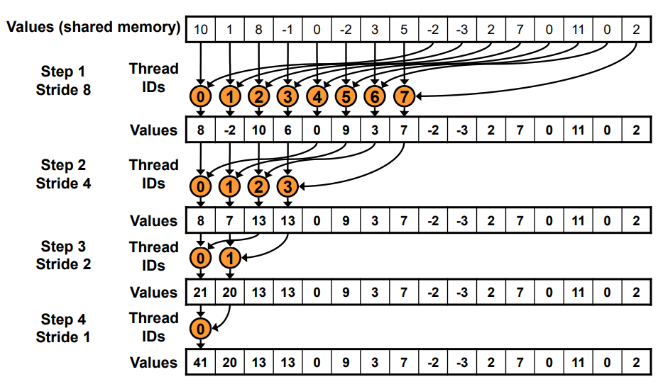
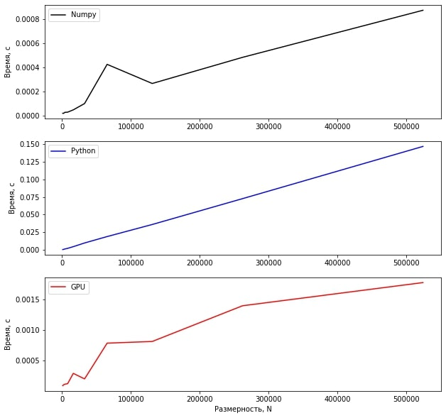
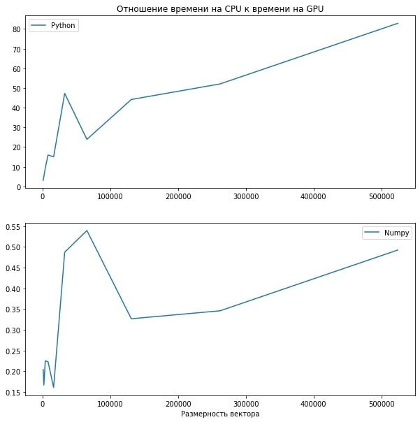

# Lab №1 - Vector Reduction
## Borisov Dmitriy 6133-010402D

## Задание

__Задача__: реализовать алгоритм сложения элементов вектора

__Язык__: C++ или Python

__Входные данные__: Вектор размером 1 000..1 000 000 значений.

__Выходные данные__: сумма элементов вектора + время вычисления

__Реализация должна содержать 2 функции перемножения матриц__: 2 функции сложения элементов вектора: на CPU и на
GPU с применением CUDA.

__Отчет о проделанной лабораторной работе__ - это git-репозиторий с исходным кодом реализации + описание проделанной работы там же в readme.
Необходимо описать реализацию, объяснив, что конкретно было распараллелено и почему.

__Провести эксперименты__:  получить сумму векторов разных размеров (провести 5 или более экспериментов), посчитать ускорение. Результаты привести в виде таблицы/графика.

## Техническое оборудование
__Язык программирования__: Python v3.7.12

__IDE__: Google Colaboratory

__GPU__: Tesla K80

__CPU__: Intel(R) Xeon(R) CPU @ 2.30GHz

## Описание
Функция параллельного суммирования вектора __на GPU__ представлена в виде строкового параметра с кодом на C++, который заносится в компилятор библиотеки __pycuda__. Полный разбор редукции вектора на CUDA представлен в источнике: https://developer.download.nvidia.com/assets/cuda/files/reduction.pdf

Операции суммирования вектора __на CPU__ представлены в виде двух функции: __sum__ библиотеки __numpy__ и стандартной функции __sum__ языка __Python__.

Вызов данных функций осуществляется ***count_iteration*** раз для каждой размерности (***sizes***) с замером среднего времени выполнения с помощь библиотеки __time__.

Вектор заполняется единицами для удобной проверки суммирования, выделяется память для исходного и результирующего векторов на CPU и на GPU. Подсчёт количества нитей для выполнения на GPU выполняется точным покрытием размерности вектора, поделённого пополам.

## Графики

## Таблица
<table border="0" cellpadding="0" cellspacing="0" id="sheet0" class="sheet0 gridlines">
    <col class="col0">
    <col class="col1">
    <col class="col2">
    <col class="col3">
    <tbody>
        <tr class="row0">
        <td class="column0">&nbsp;</td>
        <td class="column1 style1 s">Numpy</td>
        <td class="column2 style1 s">Python</td>
        <td class="column3 style1 s">GPU</td>
        </tr>
        <tr class="row1">
        <td class="column0 style1 n">1024</td>
        <td class="column1 style0 n">1.9097328186035E-5</td>
        <td class="column2 style0 n">0.00028626918792725</td>
        <td class="column3 style0 n">9.3603134155273E-5</td>
        </tr>
        <tr class="row2">
        <td class="column0 style1 n">2048</td>
        <td class="column1 style0 n">1.7905235290527E-5</td>
        <td class="column2 style0 n">0.00053930282592773</td>
        <td class="column3 style0 n">0.00010733604431152</td>
        </tr>
        <tr class="row3">
        <td class="column0 style1 n">4096</td>
        <td class="column1 style0 n">2.6631355285645E-5</td>
        <td class="column2 style0 n">0.0011003732681274</td>
        <td class="column3 style0 n">0.00011825561523438</td>
        </tr>
        <tr class="row4">
        <td class="column0 style1 n">8192</td>
        <td class="column1 style0 n">2.8395652770996E-5</td>
        <td class="column2 style0 n">0.00202796459198</td>
        <td class="column3 style0 n">0.00012750625610352</td>
        </tr>
        <tr class="row5">
        <td class="column0 style1 n">16384</td>
        <td class="column1 style0 n">4.7421455383301E-5</td>
        <td class="column2 style0 n">0.004430079460144</td>
        <td class="column3 style0 n">0.00029478073120117</td>
        </tr>
        <tr class="row6">
        <td class="column0 style1 n">32768</td>
        <td class="column1 style0 n">9.9730491638184E-5</td>
        <td class="column2 style0 n">0.0096674919128418</td>
        <td class="column3 style0 n">0.00020475387573242</td>
        </tr>
        <tr class="row7">
        <td class="column0 style1 n">65536</td>
        <td class="column1 style0 n">0.00042426586151123</td>
        <td class="column2 style0 n">0.018770360946655</td>
        <td class="column3 style0 n">0.00078659057617187</td>
        </tr>
        <tr class="row8">
        <td class="column0 style1 n">131072</td>
        <td class="column1 style0 n">0.00026578903198242</td>
        <td class="column2 style0 n">0.035921120643616</td>
        <td class="column3 style0 n">0.00081386566162109</td>
        </tr>
        <tr class="row9">
        <td class="column0 style1 n">262144</td>
        <td class="column1 style0 n">0.00048224925994873</td>
        <td class="column2 style0 n">0.072600197792053</td>
        <td class="column3 style0 n">0.0013946771621704</td>
        </tr>
        <tr class="row10">
        <td class="column0 style1 n">524288</td>
        <td class="column1 style0 n">0.00087230205535889</td>
        <td class="column2 style0 n">0.14678933620453</td>
        <td class="column3 style0 n">0.0017720222473145</td>
        </tr>
    </tbody>
</table>

## Вывод
Вычисление суммы вектора значений на языке Python выгоднее всего выполнять при помощи операции sum библиотеки __numpy__. Реализация на __CUDA__ проигрывает реализации от numpy, но существенно выигрывает у стандартной функции __sum__ языка __Python__.